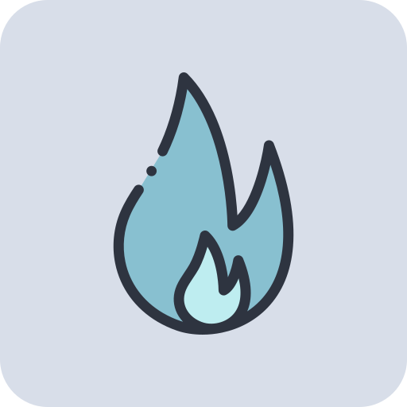

# Ignite

> 🏗️ IaC Terraform for testing implementations


## Global Definition

```GO
variable "globals" {  
	default = {  
        account     = "fronity"
        product     = "ignite"
        stack       = "server"
        environment = "local"
        resource    = "ignite_server"
        project     = "dashboard"
	}  
}
```

## 🦺 Architecture Definition

### Rules Styles

Properly naming AWS resources is important for the management, tracking, and security of your resources:

1. **Descriptive:** Your resource names should be descriptive and meaningful. They must provide an indication of what
   the resource is and what it is used for.
2. **Consistency:** Maintain consistency in your naming scheme. This can help you find and sort resources more easily.
3. **Avoid special characters:** Some AWS resources do not allow the use of certain special characters in names. As a
   good practice, try to only use lowercase letters, numbers, and hyphens.
4. **Include the environment:** If you're working with multiple environments (such as development, test, production),
   consider including the environment name in the resource name.
5. **Include Region:** For region-specific resources, it may be helpful to include the region name in the resource name.
6. **Include the project or application:** If you have multiple projects or applications that use AWS resources,
   including the project or application name can be helpful.
7. **Avoid sensitive information:** Do not include sensitive or confidential information in resource names. Resource
   names are often visible in logs and elsewhere.
8. **Keep names short:** Some AWS resources have limits on name length. Try to keep names short and to the point.
9. **Prefix/Suffix Important:** Make sure the most important information is at the beginning or end of the name, as long
   names can sometimes be truncated in the AWS console.

Following the above rules, we have defined the following naming convention:

1. VPC (Virtual Private Cloud): `prd-appname-us-east-1-vpc`
    - `prd`: indicates the environment (production).
    - `appname`: application name.
    - `us-east-1`: operation region.
    - `vpc`: indicates the type of resource.
2. Subnet: `prd-appname-us-east-1-public-subnet-1`
    - `public`: indicate the scope for this subnet. For the private subnets could be `private`.
    - The number at the end can be used to differentiate between multiple subnets within the same VPC.
3. Internet Gateway: `prd-appname-us-east-1-igw`
    - `igw`: is a common abbreviation for _"internet gateway"_.
4. Security Groups: `prd-appname-us-east-1-ec2-sg`
    - `ec2`: indicates that this is a security group for _"EC2"_ instances. If you have security groups for other types
      of resources (such as _"RDS"_ or _"ELB"_), you can indicate that here.
    - `sg`: an abbreviation for _"security group"_.
5. Load Balancers: `prd-appname-us-east-1-app-lb`
    - `app`: indicates that this is an application load balancer. If you have a network load balancer, you could use _"
      network"_ instead.
    - `lb`: an abbreviation for _"load balancer"_.

### Modules Structure

```MARKDOWN
⎼ modules
⌙ compute
⌙ monitor
⌙ network
⌙ secrets
⌙ security
⌙ storage
```

The modules directory contains subdirectories for each type of resource:

- **compute**: Compute resources (such as _"ECS"_ instances).
- **monitor**: Monitoring resources (such as _"CloudWatch"_ alarms).
- **network**: Network resources (such as _"VPCs"_ and _"subnets"_).
- **secrets**: Secrets resources (such as _"Doppler"_).
- **security**: Security resources (such as _"IAM"_ policies).
- **storage**: Storage resources (such as _"S3"_ buckets or _"ECR"_).